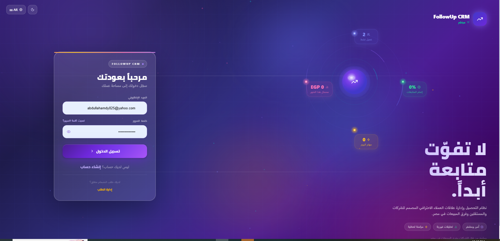
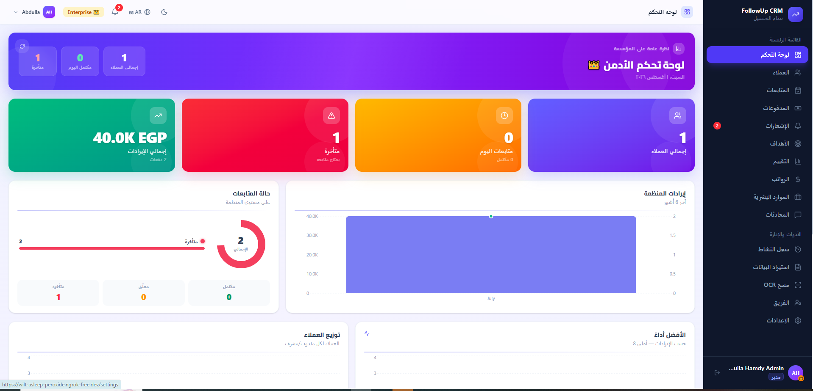
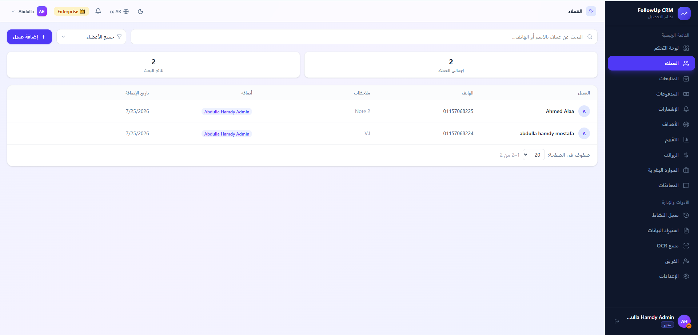
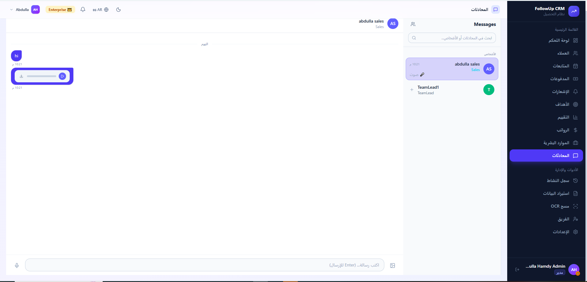

<div align="center">

# FollowUp CRM — DealTrack

### Multi-tenant SaaS CRM for sales teams and collection companies

[](https://dotnet.microsoft.com)
[](https://react.dev)
[](https://mysql.com)
[](https://docker.com)
[](https://learn.microsoft.com/aspnet/core/signalr)
[](https://rabbitmq.com)

A production-ready CRM system built for sales teams and collection companies in Egypt. Supports multiple organizations on a single deployment, role-based access control, real-time notifications, AI-powered OCR scanning, and payment subscription management.

</div>

---

## Screenshots

| Login | Dashboard |
|-------|-----------|
|  |  |

| Clients | Chat |
|---------|------|
|  |  |

> **Live demo:** [https://your-ngrok-domain.ngrok-free.app](https://your-ngrok-domain.ngrok-free.app)

---

## Features

### Core CRM
- **Client management** — add, edit, search, paginate, bulk import via Excel/CSV
- **Follow-up tracking** — schedule and assign follow-ups; auto-mark missed ones via background job
- **Payment recording** — per-client payment history, deal amount tracking, financial summaries
- **Real-time notifications** — follow-up reminders, payment alerts, system events via SignalR

### Team & Organization
- **Multi-tenant architecture** — each company is fully isolated; data never leaks across tenants
- **Role-based access control** — Admin, TeamLead, Sales, Accountant, HR, SuperAdmin
- **Team management** — invite members by email, assign to team leads, transfer between teams
- **Join request flow** — members request to join an org; admin approves or rejects

### Subscription & Payments
- **4-tier plan system** — Free → Advanced → Pro → Enterprise with enforced feature limits
- **Paymob payment gateway** — initiate subscription upgrades, webhook confirmation, auto-upgrade on payment
- **Individual users** — users without an org automatically get the Advanced plan

### AI & Automation
- **OCR document scanning** — upload invoice images; Mistral AI extracts client name, phone, amount
- **Background jobs** — Hangfire auto-marks overdue follow-ups as Missed every night
- **Excel import/export** — bulk import clients from spreadsheet; export to Excel (Pro+)

### Communication
- **Real-time chat** — DM and group conversations, file/image sharing, message history
- **Email notifications** — follow-up reminders, password reset, invitation emails via Gmail SMTP

### Admin & Operations
- **Activity audit log** — every create/update/delete is logged with user, entity, timestamp (Enterprise)
- **Super Admin panel** — manage all tenants, block/unblock, impersonate, view platform stats
- **Kill switch** — emergency session revocation and maintenance mode with scheduled resume
- **Salary management** — set base salaries, add bonuses/deductions, monthly payroll view
- **HR action requests** — warnings, promotions, transfers, vacation — with approval workflow
- **Targets & Feedback** — set monthly targets per user, track progress, team performance view

### Internationalization
- **4 languages** — English, Arabic (RTL), French, German
- Language persisted per user in localStorage

---

## Architecture

```
┌─────────────────────────────────────────────────────────────────┐
│                        Docker Compose                           │
│                                                                 │
│  ┌──────────┐    ┌──────────┐    ┌──────────┐  ┌───────────┐  │
│  │  nginx   │───▶│ .NET API │───▶│  MySQL   │  │ RabbitMQ  │  │
│  │ :80      │    │ :8080    │    │  :3306   │  │  :5672    │  │
│  └──────────┘    └──────────┘    └──────────┘  └───────────┘  │
│       │               │                               │         │
│  React SPA       SignalR Hubs               ┌─────────────────┐│
│  (Vite build)    Hangfire Jobs              │   OCR Service   ││
│                                             │  (Python/Mistral)│
│                                             └─────────────────┘│
│  ┌──────────────────────────────────────────────────────────┐  │
│  │  ngrok — public HTTPS tunnel (Paymob webhooks, demo)    │  │
│  └──────────────────────────────────────────────────────────┘  │
└─────────────────────────────────────────────────────────────────┘
```

### Backend — Clean Architecture
```
DealTrack/
├── DealTrack.API/           # Controllers, Middleware, Hubs, Filters
├── DealTrack.Application/   # Services, DTOs, Interfaces, Mappings
├── DealTrack.Domain/        # Entities, Enums, Constants (no dependencies)
└── DealTrack.Infrastructure/# EF Core, Repositories, Background Jobs
```

### Tech Stack

| Layer | Technology |
|-------|-----------|
| Frontend | React 19, Vite, Tailwind CSS v4, Recharts, lucide-react |
| Backend | ASP.NET Core 8, Entity Framework Core, AutoMapper |
| Auth | JWT (15-min access) + Refresh Token rotation (7-day) |
| Database | MySQL 8 via Pomelo EF provider |
| Real-time | SignalR (chat + notifications) |
| Queue | RabbitMQ (OCR jobs) |
| Background | Hangfire (follow-up auto-miss job) |
| AI/OCR | Mistral AI via Python microservice |
| Payments | Paymob (Egyptian payment gateway) |
| Email | Gmail SMTP |
| Logging | Serilog + Seq |
| Deploy | Docker Compose + ghcr.io + Watchtower (auto-update) |
| Tunnel | ngrok (static domain for Paymob webhooks) |

---

## Quick Start (Docker)

### Prerequisites
- [Docker Desktop](https://www.docker.com/products/docker-desktop) installed and running

### Run in 3 commands

```bash
# 1. Login to registry (one-time)
docker login ghcr.io -u abdulla662 -p <token>

# 2. Copy customer-deploy/ folder, fill in .env, then:
docker compose up -d

# 3. Open browser
# http://localhost
```

### Environment variables (`.env`)

| Variable | Description |
|----------|-------------|
| `MYSQL_ROOT_PASSWORD` | Database password |
| `JWT_KEY` | Secret key for signing JWTs (min 64 chars) |
| `GMAIL_USERNAME` | Gmail address for sending emails |
| `GMAIL_APP_PASSWORD` | Gmail app password (not your login password) |
| `PAYMOB_API_KEY` | Paymob API key for payment processing |
| `PAYMOB_INTEGRATION_ID` | Paymob integration ID |
| `PAYMOB_HMAC_SECRET` | Paymob HMAC secret for webhook verification |
| `NGROK_AUTHTOKEN` | ngrok auth token for public URL tunnel |
| `NGROK_DOMAIN` | Your static ngrok domain (e.g. `xyz.ngrok-free.app`) |
| `PUBLIC_URL` | Full public URL (`https://xyz.ngrok-free.app`) |
| `KILLSWITCH_CODE` | Secret code to activate emergency kill switch |

---

## Development Setup

### Backend
```bash
# Requires .NET 8 SDK and a running MySQL instance
cd DealTrack.API
dotnet run --launch-profile https
# API runs at https://localhost:7071
# Swagger at https://localhost:7071/swagger
```

### Frontend
```bash
cd ../FrontEnd
echo "VITE_API_URL=https://localhost:7071" > .env
npm install
npm run dev
# App runs at http://localhost:5173
```

---

## API Overview

| Resource | Endpoints |
|----------|-----------|
| Auth | `POST /api/auth/login`, `/register`, `/forgot-password`, `/reset-password`, `/refresh` |
| Clients | `GET/POST /api/clients`, `GET/PUT/DELETE /api/clients/{id}`, `/export`, `/import` |
| Follow-ups | `GET/POST /api/followups`, `PUT /api/followups/{id}`, `PATCH /{id}/done` |
| Payments | `GET/POST /api/payments`, `GET /api/payments/client/{id}`, `/summaries` |
| Notifications | `GET /api/notifications`, `PUT /{id}/read`, `/read-all` |
| Chat | `GET /api/chat/conversations`, `POST /dm/{userId}`, `GET /{convId}/messages` |
| Team | `GET /api/teams`, `POST /api/invites`, `DELETE /api/teams/{userId}` |
| Targets | `POST /api/target`, `GET /api/target/my`, `/api/target/team` |
| Salary | `POST /api/salary/base`, `/salary/adjustment`, `GET /api/salary`, `/salary/my` |
| HR | `GET/POST /api/hr/actions`, `PUT /api/hr/actions/{id}/review` |
| Dashboard | `GET /api/dashboard`, `/api/dashboard/landing-stats` |
| Activity Log | `GET /api/activitylogs` |
| OCR | `POST /api/ocr/process`, `/api/ocr/save-clients` |
| Super Admin | `GET /api/super-admin/tenants`, `/stats`, `POST /impersonate/{tenantId}` |
| Kill Switch | `POST /api/m3r9-ctrl` |

---

## Security

- JWT access tokens expire in **15 minutes**; silent refresh via rotating refresh tokens (7 days)
- Rate limiting: **5 login attempts/min per IP**, 100 API requests/min per user
- All tenant data is scoped by `TenantId` — no cross-tenant data access possible
- Hangfire dashboard restricted to Admin role only
- Kill switch requires a secret code + logs action with IP and timestamp
- Password reset tokens are single-use and expire

---

## License

Private — all rights reserved. Contact the author for licensing inquiries.

---

<div align="center">
Built by <a href="https://github.com/abdulla662">Abdulla Hamdy</a>
</div>
